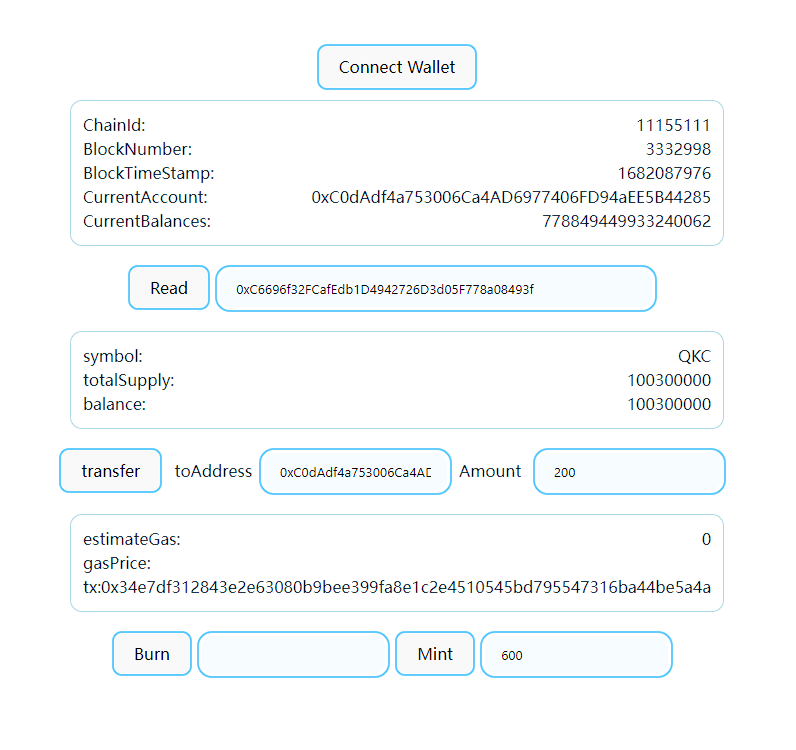

# erc20-with-web

- 测试网：Sepolia
- 浏览器：<https://sepolia.etherscan.io/>

## 作业1
合约地址：
```
0xC6696f32FCafEdb1D4942726D3d05F778a08493f
```
交互代码：
[App.tsx](./src/App.tsx)

## 作业2 & 作业3
运行命令：
```shell
git clone https://github.com/anynya/erc20-with-web.git
cd erc20-with-web
yarn
yarn compile
yarn dev
```

运行结果：

